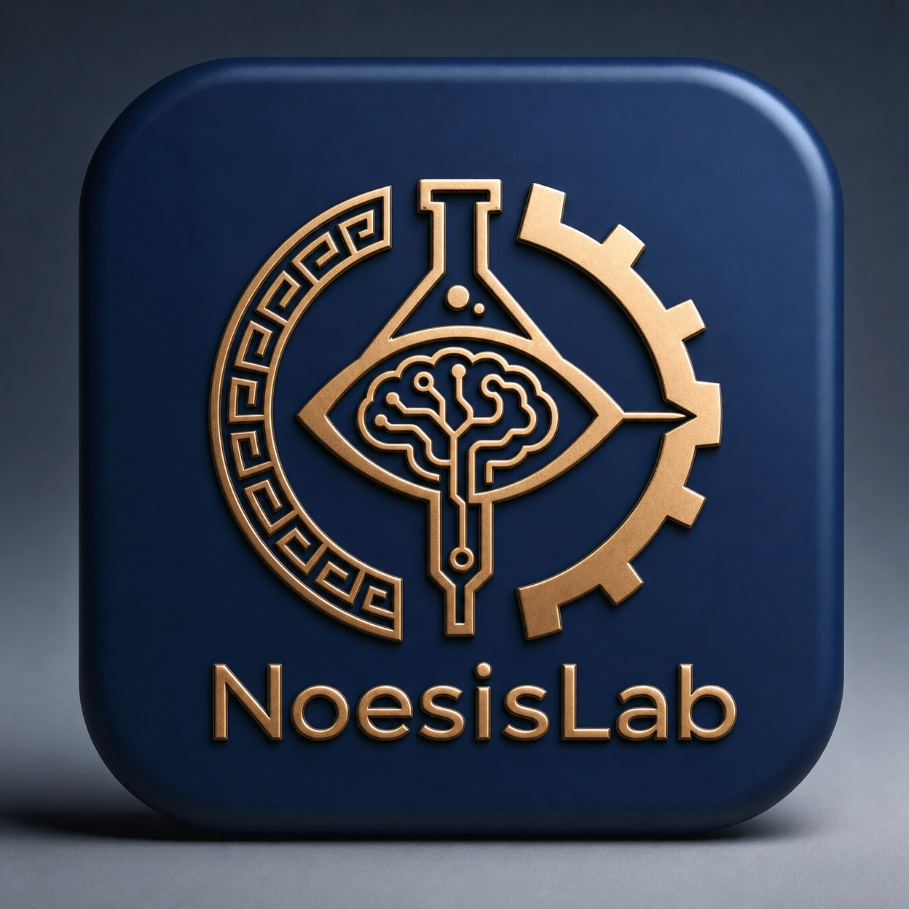
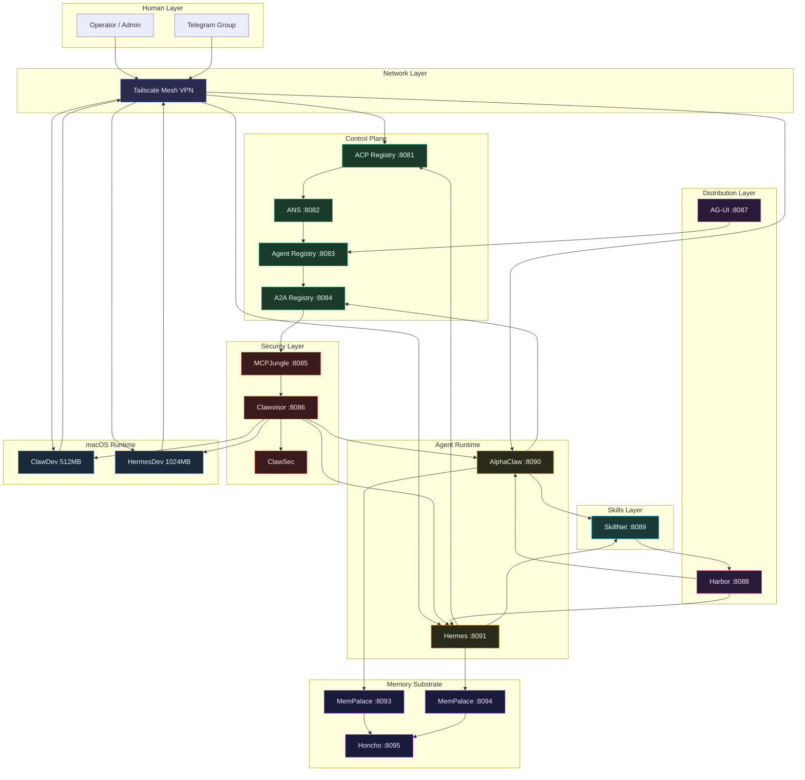
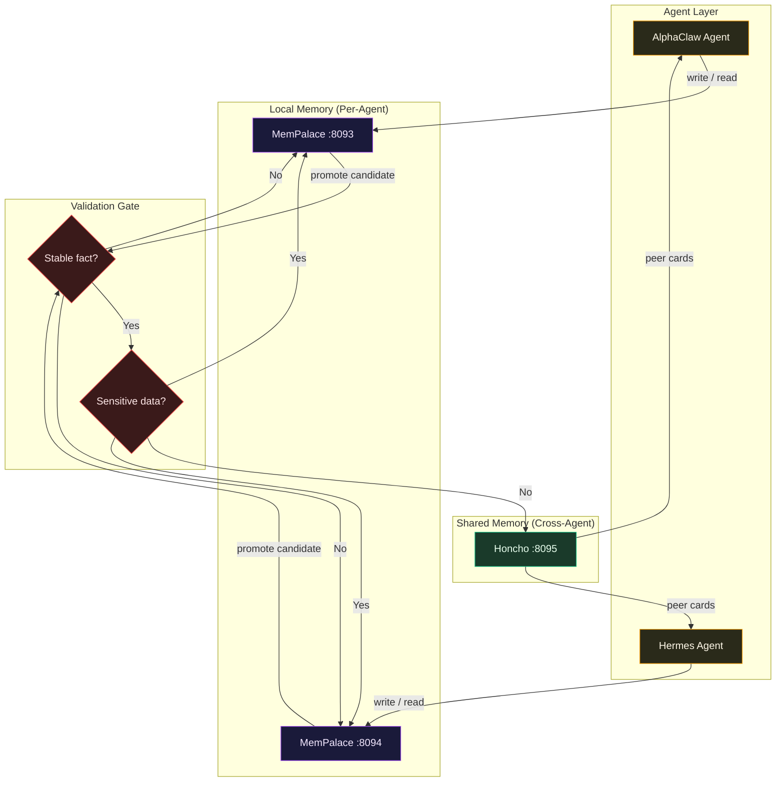

<div align="center">
  
  <h1>NoesisPraxis Ansible Stack</h1>
  <p><strong>Infrastructure-as-code for autonomous multi-agent systems</strong></p>

  [](https://www.ansible.com/)
  [](https://www.docker.com/)
  [](https://tailscale.com/)
  [](https://www.apple.com/macos/)
  [](LICENSE)
  []()

  <p>
    <a href="#quick-start">Quick Start</a> •
    <a href="#stack-components">Stack</a> •
    <a href="#repository-layout">Layout</a> •
    <a href="#security-and-secrets">Security</a> •
    <a href="#mac-specific-notes">macOS</a>
  </p>
</div>

---

## Purpose

This repository is the **single source of truth** for deploying, maintaining, and operating the NoesisPraxis agent stack. It manages registries, security boundaries, agent runtimes, macOS services, and communications through idempotent Ansible playbooks and roles.

> Designed for local-first, home-lab operation with production-ready expansion paths.

## Stack Components

| Component | Purpose | Port | Status |
|-----------|---------|------|--------|
| **ACP Registry** | Agent-client protocol registry and lifecycle tracking | 8081 | Complete |
| **ANS** | Agent Name Service — secure naming, discovery, certificates | 8082 | Complete |
| **Agent Registry** | Centralized governance dashboard for agents, skills, MCPs | 8083 | Complete |
| **A2A Registry** | Live A2A agent discovery and Agent Card management | 8084 | Complete |
| **MCPJungle** | MCP server registry and approved tool gateway | 8085 | Complete |
| **Clawvisor** | Security layer — policy, identity, sandboxing, access control | 8086 | Complete |
| **ClawSec** | Security scanning integration for AlphaClaw and Hermes | — | Complete |
| **AG-UI** | User-facing protocol layer and event routing | 8087 | Complete |
| **Harbor** | OCI artifact registry for agent images | 8088 | Complete |
| **SkillNet** | Dynamic skill discovery, search, evaluation, installation | 8089 | Complete |
| **AlphaClaw** | Generic Dockerized agent runtime | 8090 | Complete |
| **Hermes** | Generic Dockerized supervisor/assistant runtime | 8091 | Complete |
| **MemPalace** | Per-agent memory substrate (AlphaClaw:8093, Hermes:8094) | 8093-8094 | Complete |
| **Honcho** | Shared secondary memory substrate | 8095 | Complete |
| **Telegram** | Human-in-the-loop group chat communications | — | Complete |
| **Tailscale** | Secure mesh networking for remote management | — | Complete |
| **macOS ClawDev** | Lightweight AlphaClaw for Apple Silicon | localhost | Complete |
| **macOS HermesDev** | Local Hermes supervisor for Apple Silicon | localhost | Complete |

## Quick Start

```bash
# Bootstrap the control node
ansible-playbook -i inventory/local/hosts.ini playbooks/bootstrap.yml

# Deploy full stack (local)
ansible-playbook -i inventory/local/hosts.ini playbooks/site.yml

# Run specific phases
ansible-playbook -i inventory/local/hosts.ini playbooks/master-stack.yml --tags foundation,security

# Deploy individual services
ansible-playbook -i inventory/local/hosts.ini playbooks/ag-ui.yml
ansible-playbook -i inventory/local/hosts.ini playbooks/harbor.yml
ansible-playbook -i inventory/local/hosts.ini playbooks/clawsec.yml
ansible-playbook -i inventory/local/hosts.ini playbooks/skillnet.yml
ansible-playbook -i inventory/local/hosts.ini playbooks/mempalace.yml
ansible-playbook -i inventory/local/hosts.ini playbooks/honcho.yml
ansible-playbook -i inventory/local/hosts.ini playbooks/openclaw-acp.yml
ansible-playbook -i inventory/local/hosts.ini playbooks/hermes-acp.yml

# Validate health
ansible-playbook -i inventory/local/hosts.ini playbooks/validate.yml

# macOS agents over Tailscale
ansible-playbook -i inventory/tailscale/hosts.ini playbooks/macos-clawdev.yml
ansible-playbook -i inventory/tailscale/hosts.ini playbooks/macos-hermesdev.yml

# Kubernetes deployments
helm install openclaw charts/openclaw -f charts/values/values-dev.yaml
helm install hermes charts/hermes -f charts/values/values-dev.yaml
```

## Repository Layout

```
.
├── inventory/          # local, tailscale, production inventories
├── playbooks/          # 29 layer-specific and orchestration playbooks
├── roles/              # 20 reusable roles per stack component
├── charts/             # 16 Helm charts for Kubernetes/K3s deployment
├── group_vars/         # Shared group variables (46 vars, 7 feature toggles)
├── host_vars/          # Per-host variables
├── templates/          # Global templates (common, registries, macos, security, memory)
├── files/              # Static files (JSON schemas, helper scripts)
└── scripts/            # Operational helper scripts
```

## Infrastructure Diagram



## Memory Promotion Flow



**Memory Routing Policy:**
- **MemPalace first** — All local, private, session-scoped memory writes go to per-agent MemPalace
- **Honcho second** — Shared durable memory and cross-agent continuity via Honcho
- **Promotion queue** — Stable, non-sensitive facts promote from MemPalace to Honcho
- **Validation gate** — Explicit check before Honcho peer card updates; secrets and ephemeral tokens blocked
- **Peer cards** — Stable, atomic, deduplicated facts shared back to all agents

---

## Orchestration Flow

```
PHASE 0  Bootstrap        → Host prep, secrets, preflight
PHASE 1  Foundation       → ACP, ANS, Agent Registry, A2A registries
PHASE 2  Security         → MCPJungle, Clawvisor policies, ClawSec scanning
PHASE 3  Distribution     → AG-UI, Harbor OCI registry
PHASE 4  Skills           → SkillNet dynamic discovery and MCP server
PHASE 5  Runtime          → Dockerized AlphaClaw and Hermes deployments
PHASE 6  Memory           → MemPalace per-agent, Honcho shared substrate
PHASE 7  macOS            → launchd services, resource budgets, Tailscale exposure
PHASE 8  Communications   → Telegram bot provisioning and group integration
PHASE 9  Networking       → Tailscale mesh, remote management wiring
PHASE 10 ACP Registration → AlphaClaw and Hermes ACP agent registration
PHASE 11 Sync & Backup    → Cross-registry sync, backup, restore hooks
PHASE 12 Validation       → Health checks, schema validation, connectivity tests
```

## Inventory and Environments

| Inventory | Use Case | Connection |
|-----------|----------|------------|
| `inventory/local/` | Local development and Dockerized services | `local` |
| `inventory/tailscale/` | Remote macOS management over Tailscale | SSH over tailnet |
| `inventory/production/` | Production deployment targets | SSH |

```bash
# Select environment
ansible-playbook -i inventory/local/hosts.ini       playbooks/site.yml
ansible-playbook -i inventory/tailscale/hosts.ini   playbooks/site.yml
ansible-playbook -i inventory/production/hosts.ini  playbooks/site.yml
```

## Security and Secrets

- **Vault-encrypted** — Secrets live in `group_vars/secrets.yml` and `inventory/*/group_vars/secrets.yml`
- **Zero hardcoded credentials** — No tokens, keys, or passwords in templates or playbooks
- **Least-privilege** — Default-deny Clawvisor policies, scoped MCP tool access
- **Local-first** — No broad network exposure; localhost and tailnet only

## macOS Specific Notes

- Agents run as **per-user `launchd`** services with generated plists
- **Conservative resource budgets** — suitable for MacBook Pro M1 Pro with 16 GB RAM
  - ClawDev: 50% CPU cap, 512 MB RAM
  - HermesDev: 50% CPU cap, 1024 MB RAM
- Services bind to `localhost` and are reachable over the **Tailscale tailnet**
- All state lives in **user-space paths**:
  - Config: `~/.config/noesis/`
  - Logs: `~/.local/share/noesis/`
  - Plists: `~/Library/LaunchAgents/`

## Operational Scripts

| Script | Purpose |
|--------|---------|
| `scripts/bootstrap.sh` | Initial host preparation |
| `scripts/validate.sh` | Stack health and schema validation |
| `scripts/backup.sh` | Registry and config backup |
| `scripts/restore.sh` | Registry and config restore |
| `scripts/sync-registries.sh` | Cross-registry synchronization |

## Maintenance

```bash
# Rolling maintenance window
ansible-playbook -i inventory/local/hosts.ini playbooks/maintenance.yml

# Controlled rollback
ansible-playbook -i inventory/local/hosts.ini playbooks/rollback.yml

# Registry backup
ansible-playbook -i inventory/local/hosts.ini playbooks/backup.yml
```

---

<div align="center">
  <sub>Built with discipline. No hype. No exceptions.</sub>
</div>
